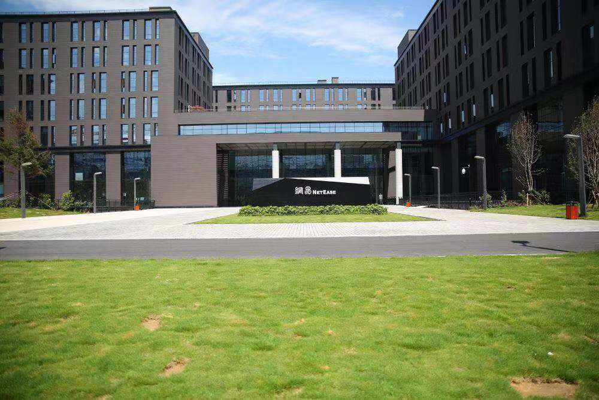

## 网易游戏内推

### 一. 公司介绍

[网易公司](https://www.163.com/)（NASDAQ: NTES）是中国的互联网公司，利用互联网技术，加强人与人之间信息的交流和共享，实现“网聚人的力量”。创始人兼CEO是丁磊。在开发互联网应用、服务及其它技术方面，网易在推出了包括中文全文检索、全中文大容量免费邮件系统、无限容量免费网络相册、免费电子贺卡站、网上虚拟社区、网上拍卖平台、24小时客户服务中心在内的业内领先产品或服务，还通过自主研发推出了国产网络游戏。网易公司推出了门户网站、在线游戏、电子邮箱、在线教育、电子商务、在线音乐、网易bobo等多种服务。网易在广州天河智慧城的总部项目计划2019年1月建成，网易游戏总部将入驻。

### 二. 办公环境

### 三. 招聘岗位

[1、校园招聘](https://campus.163.com/app/game/hy)

[2、实习招聘](https://campus.163.com/app/game/hy)

[3、社会招聘](#)

更新招聘信息可关注: [网易招聘](https://campus.163.com/app/index)

### 四. 内推方式

微信: adair1990

邮件：polyipnus@163.com

欢迎师弟师妹前来咨询~~
